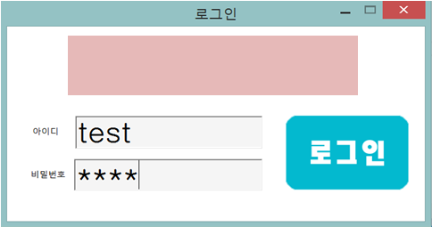
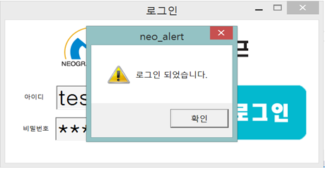
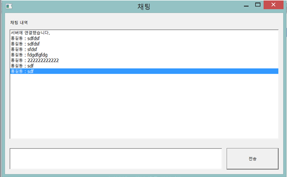
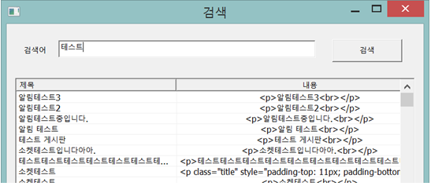
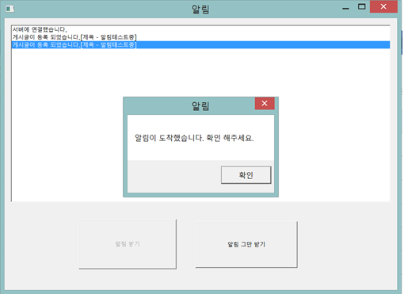

# 개요 (Overview)

- MFC를 기반으로 만들어진 인트라넷 pc버전 입니다.

- 채팅 서버의 경우 주변에 굴러다니는 소스를 이용하였습니다.

- libmysql.dll를 이용하였습니다.

# 주요기능

- 로그인 : 회사 사람들만 이용가능

- 채팅 : 하나의 채팅 방으로 회사 사람들이 소통 가능

- 게시판 검색 : 인트라넷에 있는 게시판 검색

- 인트라넷 알림 : 인트라넷에서 발생되는 이벤트 알림

# 실행화면

    

    

    

    

    

    

